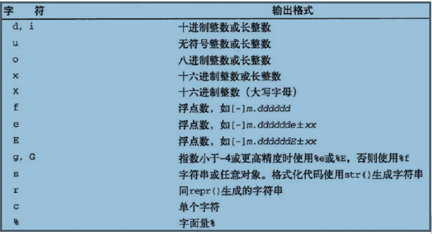

# Python快速入门

[Python官网](https://www.python.org/)
    
[Python解释器下载](https://www.python.org/downloads/)  

[Python官方文档](https://www.python.org/doc/)  

[Python第三方库](https://pypi.python.org/pypi)  

### 编程语言：
- 用户：问题，问题空间；

- 计算机：解决问题，解空间；

把用户在问题空间中的问题抽象为解空间中能解决问题的方案就是编程；

编程语言迭代：机器代码 --> 微码编程 --> 高级语言

把人类能表述的解决方案翻译为计算机能识别的解决方案的翻译官是：编译器或解释器；

高级和低级：指的是，是否离人类语言或思维方式接近；越高级的语言，离人类越近，人类编程容易，机器理解困难，执行效率低；

### Python语言的三种应用场景：

- shell编程，不建议使用；此种应用场景建议使用bash；但python在文本处理方面的能力是shell无法比拟的；

- 编程语言：用于实现多种编程语言的链接，表现得像控制语言(胶水语言)，一种完备的编程语言；

- Web开发: web框架(Django、Flask等)

### Python语言的缺点：

- 字节码: bytecode

	如果与Java语言在类文件格式上统一的话，可以直接调用，或在JVM上执行；

        因为不编译，python在执行效率上低于C/C++等语言；

### python语言执行流程：
	
	
### python解释器：

- CPython： 原始、标准的实现；
- Jython： Java实现的Python解释器；
- IronPython： .Net实现的Python解释器；

### python性能优化工具：
- PyPy，用python实现的python语言的动态编译器；执行效率极高；

- Shed Skin： Python编译器，能将Python代码转换成优化的C++代码；

### 编写执行Python代码：
- 交互式解释器；
- python程序文件：
    交互式模式下的程序执行完成后难以再次执行；

    写成程序文件的形式方便多次执行；

    python的类包含了一系列预编译好的语句的程序文件被称为“模块”

    能够直接运行的模块文件通常被称为脚本，即程序的“顶层文件”。

### python程序可以分解成模块、语句、表达式和对象：
- 程序由模块构成；
- 模块包含语句；
- 语句包含表达式；
- 表达式建立并处理对象：
- 表达式是“某事”，而语句是“做某事(即指令)";
- 语句的特性：他们改变了事物。例如，赋值语句改变了变量，print语句改变了屏幕输出等；


### 编程语言：
- 面向过程：

	以指令为中心，由指令处理数据；

	考虑如何组织代码解决问题；

- 面向对象：

	以数据为中心，所有的处理代码都围绕数据展开；

	如何设计数据结构组织数据，并提供对此类数据所允许的处理操作；

**python既可以面向过程，也可以面向对象，但python中的数据都存储为对象；**

#### 内置函数：
dir(platform),查看该对象包含的方法、属性等；

---

- 在Linux上使用新版本的python：

    但切忌卸载原有版本；系统部分组件依赖于系统自带的python解释器 ；

- 简单方法：

	1、编译安装新版本至某特定路径；

	2、使用pyenv管理多版本并存，详见[python编程环境准备](PythonEnvironment.md)；

- 编译安装Python:  需先安装gcc编译器；

```bash
    下载python源代码；
    下载ipython；
    tar xf python*.tar.gz
    ./config --help | more                # 自行查看帮助信息；
    yum install readline-devel readline    # 安装依赖；

    ./config --prefix=/usr/local/python27
    make && make install
    /usr/local/python27/bin/python2.7
```

- 安装ipython：
```
    下载源码；
    解压；
    cd ipython
    /usr/local/pytho27/bin/python2.7 setup.py build
    /usr/local/pytho27/bin/python2.7 setup.py install
```

- 创建链接：
```bash
	ln -sv /usr/local/python27/bin/python2.7 /usr/bin/python27
	ln -sv /usr/local/python27/bin/ipython /usr/bin/ipython
```

### 数据结构：
- 通过某种方式(例如对元素进行编号)组织在一起的数据元素的集合，这些数据元素可以是数字或者字符，甚至可以是其他的数据结构；

- python的最基本数据结构是**序列**；

- 序列中的每个元素被分配一个序号————即元素的位置，也称为索引；索引从0开始编号；

- python包含6种内建的数据序列：列表、元组、字符串、Unicode字符串、buffer对象和xrange对象；


### python的关键要素：
- 基本数据类型；
- 对象引用
- 组合数据类型；
- 逻辑操作符
- 控制流语句；
- 算术操作符；
- 输入/输出 
- 函数的创建与调用；

### 内置函数
- id(Var);     查看该对象引用的对象地址；
- type(Var);   返回指定对象的类型；
- dir([object]);  --> list of strings;

### 基本数据类型：
- Integral类型：
    - 整型：不可变类型；
    - 布尔型；True，False；
- 浮点类型：
    - 浮点数；
    - 复数；
    - 十进制数字；
- 字符串: 不可变类型；

    'GNU is Not Unix',字符串是序列；

### 对象引用：
- python将所有数据存储为对象；
- python中，**变量事实上是指向内存对象的引用**；
- **动态类型**：在任何时刻，只要需要，某个对象引用都可以**重新引用一个不同的对象(可以是不同的数据类型)**
- 内建函数type()用于返回给定数据项的数据类型；
- "="用于将变量名与内存中的某个对象绑定：如果对象事先存在，就直接绑定；否则，则由"="创建引用的对象；

### 变量的命名规则：
- 只能包含字母、数字和下划线，且不能以数字开头
- 区分字母大小写；
- 禁止使用保留字；
- 以下划线开头的变量名在对python解释器有特殊意义；

### 命名惯例：
- 以单一下划线开头的变量名(_x)不会被from module import * 语句导入；
- 前后有双下划线的变量名(\_\_x\_\_)是系统定义的变量名，对python解释器有特殊意义；
- 以两个下划线开头，但结尾没有下划线的变量名(__x)是类的本地变量；
- 交互式模式下，变量名"_"用于保存最后一个表达式的结果；

**注意：变量名没有类型，变量名引用的对象才有类型；**

### 组合数据类型：
- 数据结构：

        通过某种方式(例如对元素进行编号)组织在一起的数据元素的集合；

- python常用的组合数据类型：
    - 序列类型：
        - 列表：使用[]创建，如['Call','me','Ishmeal','.']
        - 元组：使用()创建，如('one','two')
        - 字符串：也属于序列类型，字符串使用引号，单、双、三都可以；
    - 集合类型：
        - 集合
    - 映射类型：
        - 字典；


**列表是可变序列，元组是不可变序列；**

python中，组合数据类型也是对象，因此其可以嵌套；

    ['hello','world',[1,2,3]]

实质上，**列表和元组并不真正存储数据，而是存放对内存对象的引用；**

python对象可以具有其可以被调用的特定"方法(函数)"

元组、列表以及字符串等数据类型是"有大小的",也即其长度(元素个数)，可使用内置函数len()测量；

### 逻辑操作符：
逻辑运算是任何程序设计语言的基本功能；

python提供了4组逻辑运算：
- 身份操作符：

    is：判断左端对象引用是否相同于右端对象引用；也可以与None进行；

```python
In [2]: a = 10

In [3]: b = 5

In [4]: a is b
Out[4]: False

# a和b引用的是两个不同的内存对象；
In [5]: print(id(a),id(b))
9169824 9169664
```

```python
In [6]: a = 10

In [7]: b = 10

In [8]: a is b
Out[8]: True
# a和b引用的是相同的内存对象；
In [9]: print(id(a),id(b))
9169824 9169824
```
```python
In [12]: c = 15
In [14]: def test1(n):
    ...:     if n == 1:
    ...:         return None
    ...:     else:
    ...:         return True
    ...:     

In [15]: result = test1(1)

In [16]: print(id(c),id(result))
9169984 8892416

In [17]: print(c,result)
15 None

In [18]: c is result
Out[18]: False
```

- 比较操作符：

    < , > , <= , >= , != , == , <>

    <>在python3中好像已经不支持了；

    判断是否等于，必须使用==

- 成员操作符：

    in或not in： 测试成员关系；某个对象是否被包含于右端的对象中；

```python
In [10]: a = list(range(10))

In [11]: print(a)
[0, 1, 2, 3, 4, 5, 6, 7, 8, 9]

In [12]: 10 in a
Out[12]: False
# in 和 not in的结果是相反的；
In [13]: 9 not in a
Out[13]: False

In [14]: 9 in a
Out[14]: True
```

- 逻辑运算符：

    and，or，not

```python
In [16]: a = 3
In [17]: b = 5

In [19]: if b > a and b > 4:
    ...:     print("b greater than 4")
    ...: if a > 4 or b > 4:
    ...:     print("at least,one of a,b is greater than 4")
    ...: if not b > 10:
    ...:     print("b is lesser than 10")
    ...:     
b greater than 4
at least,one of a,b is greater than 4
b is lesser than 10
```

### 控制流语句：

控制流语句是过程式编程语言的基本控制机制；

python的常见的控制流语句：
- if分支语句

```python
The "if" statement
******************

The "if" statement is used for conditional execution:

   if_stmt ::= "if" expression ":" suite
               ( "elif" expression ":" suite )*
               ["else" ":" suite]

It selects exactly one of the suites by evaluating the expressions one
by one until one is found to be true (see section *Boolean operations*
for the definition of true and false); then that suite is executed
(and no other part of the "if" statement is executed or evaluated).
If all expressions are false, the suite of the "else" clause, if
present, is executed.
```

- while循环语句

```python
The "while" statement
*********************

The "while" statement is used for repeated execution as long as an
expression is true:

   while_stmt ::= "while" expression ":" suite
                  ["else" ":" suite]

This repeatedly tests the expression and, if it is true, executes the
first suite; if the expression is false (which may be the first time
it is tested) the suite of the "else" clause, if present, is executed
and the loop terminates.

A "break" statement executed in the first suite terminates the loop
without executing the "else" clause's suite.  A "continue" statement
executed in the first suite skips the rest of the suite and goes back
to testing the expression.
```

- for...in 循环语句：

```python
The "for" statement
*******************

The "for" statement is used to iterate over the elements of a sequence
(such as a string, tuple or list) or other iterable object:

   for_stmt ::= "for" target_list "in" expression_list ":" suite
                ["else" ":" suite]
```
- try

### 算术操作符：
- python提供了完整的算术操作符；
- 很多的python数据类型也可以使用增强的赋值运算符，如+=、-=等；
- 同样的功能，使用增强型赋值操作符的性能较好；
- python的int类型是不可变的，因此，增强型赋值的实际过程是创建了一个新的对象来存储结果后，将变量名执行了重新绑定；

### 输入输出：
现实中，具有实际功能的程序必须能够读取输入(如从键盘或文件中),以及产生输出，并写到终端或文件中；

**python的输入/输出:**
- 输出：

    python3：print()函数；

    python2：print语句
- 输入：

    input()

    raw_input()

python解释器提供了三种文件描述对象，分别为标准输入、标准输出和标准错误输出，他们在sys模块中分别以sys.stdin、sys.stdout和sys.stderr形式提供；

python的print语句实现打印————一个对程序员友好的标准输出流接口；

从技术角度来讲，print是把一个或多个对象转换为其文本表达形式，然后返送给标准输出或另一个类似文件的流；————流式化；

**在python中，打印与文件和流的概念联系紧密:**
- 文件写入方法是把字符串写入到任意文件；
- print默认把对象打印到stdout流，并添加了一些自动的格式化；
- 实质上，print语句只是python的人性化特性的具体实现，它提供了sys.stdout.write()的简单接口，再加上一些默认的格式设置；
- print接受一个逗号分隔的对象列表，并为行尾自动添加一个换行符，如果不需要换行，则在最后一个元素后添加逗号；

### print格式化输出：

```python
#python2:
print "String %format1 %format2 ..." % (variable1,variable2,...)
```



### 数据类型转换：
- 隐式；
- 显式：

dir(\_\_builtins\_\_): 查看所有的内置数据类型；

help(str): 获取帮助；

%后面可以使用的修饰符，(如果有，则只能按如下顺序)：

    %[(name)][flags][width][.precision]typecode

位于括号中的一个属于后面的字典的键名，用于选出一个具体项；

下面标志中的一个或多个：
```
	-：表示左对齐；
	+：表示包含数字符号，正数也会带"+"
	0：表示一个0填充；
```

一个指定最小宽度的数字；

一个小数点，用于按照精度分隔字段的宽度；

一个数字，指定要打印字符串中的最大字符个数，浮点数中小数点之后的位数，或者整数的最小位数；

**例子：**
```python
	d = {'x':32,'y':27.490325,'z':65}
	print "%(x)-10d %(y)0.3g" % d
```

### 函数的创建与调用：
函数是实现模块化编程的基本组件；

python使用def语句定义函数；
```python
def functionName(arguments):
    suite
```
函数可以参数化，通过传递不同的参数来调用；

每个python函数都有一个返回值，默认为None，也可以使用"return value"明确定义返回值；

def语句会创建一个函数对象，并同时创建一个指向该函数的对象引用；

函数也是对象，可以存储在组合数据类型中，也可以作为参数传递给其他函数；

**内置函数callable()可用于测试对象是否可调用；**

### python有众多内置函数；

列出所有内置函数：
```python
In [6]: dir(__builtin__)

dir(),help(),type(),len(),str(),id(),callable();
```
python标准库拥有众多内置模块，这些模块拥有大量函数；

python模块实际上就是包含python代码的.py文件，其拥有自定义的函数与类及变量等；

导入模块使用import语句进行，后跟模块名称（不能指定模块文件名的后缀.py)

导入一个模块后，可以访问其内部包含的任意函数，类及变量；


```python
In [1]: import random

In [3]: x = random.choice(['a','b','c','d','e','f'])

In [4]: print x
f
```

### Python编程风格：
- 语句和语法：

    - 注释：   单行注释使用#，可以从一行的任何地方开始；
    - 续行：
        - \:
	- ''': 三引号，闭合操作符，单一语句跨多行；
    - 代码组：
        - 缩进相同的一组语句构成的一个代码块
        - 首行以关键字开始，如if、while等，以冒号结束；
        - python使用缩进来分隔代码组，同一代码组的代码行必须严格左对齐，否则会造成语法错误；

    - 同一行放置多个语句：
        - 以分号(;)作为分隔符；
    - 模块:
        - 每一个Python脚本构建都可以被当成是一个模块；
        - 模块里的代码可以是一段直接执行的脚本，也可以是一些类似库函数的代码从而可由 别的模块执行导入(import)

```python
# cat mod.py
#!/usr/bin/python27
#
def printName(a):
    print a
    b = "Black"
    print a + b
```

```python
b.py
#!/usr/bin/python
# 
import mod
mod.printName("SSLinux")
```

### 标识符：
标识符是计算机语言中允许作为名字的有效字符串集合；

其中有一部分是关键字，它们是语言的标识符，因此是保留字，不能用于其它用途；

python还有称为"内建"的标识符集合，虽不是保留字，仍不推荐使用这些特别的名字；

### Python标识符：
第一个字符只能使用字母或下划线；

余下的字符可以使用字母、数字或下划线；

区分字母大小写；

---

以下是python关键字：


### 注释：
注释：既不能缺少注释，亦要避免过度注释；

文档：

	Python允许通过__doc__动态获得文档字符串；

	print str.__doc__   获取简要文档帮助；

缩进：

	统一缩进4个字符串；

标识符名称要求：见名知意；

- Python风格指南：

    英文：https://code.google.com/p/soc/wiki/PythonStyleGuide

    译文：http://www.elias.cn/Python/PythonStyleGuide

### Python命名惯例：

- 以单一下划线开头的变量名(_x)不会被from module import * 语句导入；

- 前后有双下划线的变量名(\_\_x\_\_)是系统变量名，对解释器有特殊意义；

- 以两个下划线开头、但结尾没有下划线的变量名(__x)是类的本地变量；

- 交互式模式下，只有单个下划线的变量名(_)用于保存最后一个表达式的结果；


```python
a = 'xyz'   <==> 实质相当于 a = str('xyz'):
```

str是python内置的一个类，上述过程相当于使用str类实例化了一个对象(instance).

其他内置数据类型也是一样的，但内置数据类型的定义一般不使用"a = str('xyz')的方式定义；"

### Python文件主程序：
**主程序：**

    无论当前模块是被别的模块导入还是作为脚本直接执行，都会执行这部分代码；

**注意：**所有的模块都有能力执行代码；

    最高级别的python语句(没有缩进的)在模块被导入时就会执行，无论是否真的需要执行；

- 妥当的做法：

	除了那些真正需要执行的代码以外，所有的功能代码都通过函数建立，因此：

		仅在主程序模块中编写大量的可执行代码；
		用于被导入的模块只应该存在较少的顶级代码；

- 内置变量：\_\_name\_\_，指示模块应该如何被加载：

	如果模块被导入，\_\_name\_\_的值是模块自己的名字；

	如果模块是直接执行，\_\_name\_\_的值是'\_\_main\_\_'

- 每个模块都有一个名为\_\_name\_\_的内建变量，此变量值会根据调用此模块的方式发生变化：

	如果此文件被作为模块导入，则\_\_name\_\_的值为模块名称；

	如果此文件被直接执行，则\_\_name\_\_的值为"\_\_main\_\_".

**因此**:

在被导入的模块中常会有以下方式的写法，主要是为了方便测试：
```python
if __name__ == '__main__':
    if_suit
```

