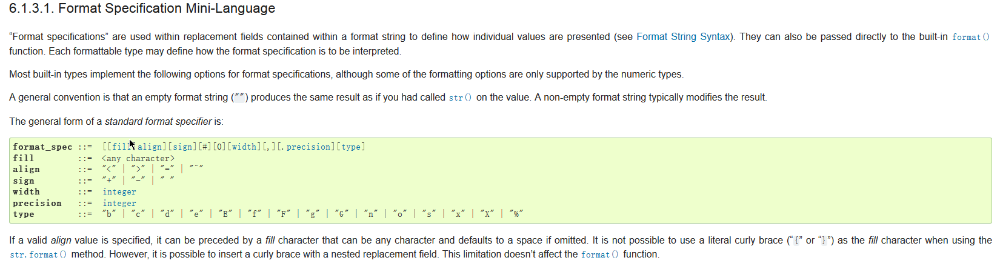

# 字符串，string
字符串在python3中是unicode序列，在python2中是byte序列；


## 定义 

单引号： ''
双引号： ""
    单/双引号只能定义单行字符串；

三引号：可定义多行字符串；

    ''' '''

    """ """

    三引号，还可以作为doc string使用；

```python
In [100]: s = 'sslinux'

In [102]: s1 = "python"

In [104]: s2 = '''linux'''

In [105]: s3 = """coding"""
```

```python
In [106]: s
Out[106]: 'sslinux'

In [107]: s[2] = 'u'  # 字符串是不可变序列；
---------------------------------------------------------------------------
TypeError                                 Traceback (most recent call last)
<ipython-input-107-d2adc02cbe9c> in <module>()
----> 1 s[2] = 'u'

TypeError: 'str' object does not support item assignment

In [108]: s[::-1]   # 反转，序列应该都可以通过切片的方式反转；
Out[108]: 'xunilss'

In [109]: s
Out[109]: 'sslinux'
```

```python 
In [110]: h,g,*c = s   # 解包，将容器中的元素分解并赋值给变量；

In [111]: print(h,g,c)
s s ['l', 'i', 'n', 'u', 'x']
```

* Unicode
```python 
In [112]: s = "中华人民共和国"

In [113]: s[0]
Out[113]: '中'

In [115]: for i in s:
     ...:     print(type(i),i)
     ...:     
<class 'str'> 中
<class 'str'> 华
<class 'str'> 人
<class 'str'> 民
<class 'str'> 共
<class 'str'> 和
<class 'str'> 国
```
python对文本的处理能力，继承自perl语言；

---

## 字符串操作：


### 连接：
* join()

    使用字符串连接一个可迭代对象中的所有元素；返回值为连接后的结果(string);

```python 
join(...)
    S.join(iterable) -> str
    
    Return a string which is the concatenation of the strings in the
    iterable.  The separator between elements is S.
```

Example:

```python 
In [118]: lst = ['my','name','is','sslinux']

In [119]: ' '.join(lst)    # 使用空格连接列表中的元素；
Out[119]: 'my name is sslinux'

In [120]: ','.join(lst)
Out[120]: 'my,name,is,sslinux'

In [121]: firstName = 'Guiyin'

In [122]: familyName = 'Xiong'

In [123]: '.'.join((firstName,familyName))    # 使用点连接元组中的元素；
Out[123]: 'Guiyin.Xiong'
```

* 加号(+) 连接字符串；

    不太建议使用加号(+)的方式进行字符串的连接，效率太低；

```python 
In [124]: 'my' + ' name'
Out[124]: 'my name'

In [125]: s = ''

In [126]: for x in lst:
     ...:     s += ' ' + x
     ...: print(s)
     ...: 
 my name is sslinux
```

---

## 分割：

* split()

```python 
split(...)
    S.split(sep=None, maxsplit=-1) -> list of strings
    # sep为分割符，不指定或为空时，以空白为分隔符；
    # maxsplit为分割的次数，默认为分割所有；
    Return a list of the words in S, using sep as the
    delimiter string.  If maxsplit is given, at most maxsplit
    splits are done. If sep is not specified or is None, any
    whitespace string is a separator and empty strings are
    removed from the result.
```

```python
In [128]: s = 'my name is Johnson'

In [129]: s.split()   # 默认分隔符为空格，分割所有；
Out[129]: ['my', 'name', 'is', 'Johnson']

In [130]: s.split('is')   # 结果中不包括分割符本身
Out[130]: ['my name ', ' Johnson']

In [131]: s.split(' ',1) # 指定从左往右分割几次；
Out[131]: ['my', 'name is Johnson']
```

* rsplit()

    跟split的分割顺序相反，从右往左；

```python 
rsplit(...)
    S.rsplit(sep=None, maxsplit=-1) -> list of strings
    
    Return a list of the words in S, using sep as the
    delimiter string, starting at the end of the string and
    working to the front.  If maxsplit is given, at most maxsplit
    splits are done. If sep is not specified, any whitespace string
    is a separator.
```

```python 
In [134]: s.rsplit()
Out[134]: ['my', 'name', 'is', 'Johnson']

In [139]: s.split()
Out[139]: ['my', 'name', 'is', 'Johnson']
# 在不指定分割次数的时候，split和rsplit的效果相同；
In [135]: s.rsplit(' ')
Out[135]: ['my', 'name', 'is', 'Johnson']

In [136]: s.split(' ',1)     # 从左往右分割；
Out[136]: ['my', 'name is Johnson']

In [138]: s.rsplit(' ',1)   # 从右往左分割；
Out[138]: ['my name is', 'Johnson']
```

Example：

```python 
In [140]: line = 'url:http://www.sslinux.com'   # 有两个冒号：

In [141]: line
Out[141]: 'url:http://www.sslinux.com'

In [142]: line.split(':')          # 这显然不是我们想要的结果；
Out[142]: ['url', 'http', '//www.sslinux.com']

In [143]: line.split(':',1)        # 这个是；
Out[143]: ['url', 'http://www.sslinux.com']

In [144]: key,value = line.split(':',1)   # 解包操作，将容器(list)中的元素分解并赋值给多个变量；

In [145]: key
Out[145]: 'url'

In [146]: value
Out[146]: 'http://www.sslinux.com'
```

* splitlines()     

    按行分割；

```python 
splitlines(...)
    S.splitlines([keepends]) -> list of strings
    # keepends 可取值True，表示分割后保留换行符；
    Return a list of the lines in S, breaking at line boundaries.
    Line breaks are not included in the resulting list unless keepends
    is given and true.
```

```python 
In [148]: text = """I am SSLinux
     ...: I'm come from Sichuan Province
     ...: I like Python"""

In [149]: text
Out[149]: "I am SSLinux\nI'm come from Sichuan Province\nI like Python"

In [150]: text.splitlines()   # keepens 默认值为False，表示是否保留换行符(\n)；
Out[150]: ['I am SSLinux', "I'm come from Sichuan Province", 'I like Python']

In [151]: text.splitlines(True)
Out[151]: ['I am SSLinux\n', "I'm come from Sichuan Province\n", 'I like Python']

In [152]: text.splitlines(False)
Out[152]: ['I am SSLinux', "I'm come from Sichuan Province", 'I like Python']
```

* partition()

```python 
partition(...)
    S.partition(sep) -> (head, sep, tail)
    # 接受参数sep(分隔符),返回元组(分割符前，分隔符，分割符后),分割符从左往右匹配；
    Search for the separator sep in S, and return the part before it,
    the separator itself, and the part after it.  If the separator is not
    found, return S and two empty strings.
```

```python 
In [154]: s
Out[154]: 'my name is Johnson'

In [155]: s.partition(' ')   # 返回值为元组；
Out[155]: ('my', ' ', 'name is Johnson')

In [156]: line
Out[156]: 'url:http://www.sslinux.com'

In [157]: line.partition(':')
Out[157]: ('url', ':', 'http://www.sslinux.com')

In [158]: key,_,value = line.partition(':')   # _表示该变量在后续过程中不引用，所以不需要保存；

In [159]: key
Out[159]: 'url'

In [160]: value
Out[160]: 'http://www.sslinux.com'
```

* rpartition()   
```python 
rpartition(...)      # 功能和partition一样，分隔符从右往左开始匹配；
    S.rpartition(sep) -> (head, sep, tail)
    
    Search for the separator sep in S, starting at the end of S, and return
    the part before it, the separator itself, and the part after it.  If the
    separator is not found, return two empty strings and S.
```
capitalize(...)
    S.capitalize() -> str
    
    Return a capitalized version of S, i.e. make the first character
    have upper case and the rest lower case.
---


## 修改

### 自然语言修改(大小写)
* capitalize()    首字母大写;返回值依然为str；
* title()  将每个单词的首字母都大写；返回值为str；
* lower()  全部转换为小写；返回str；
* upper()  全部转换为大写；返回str；
* swapcase() 对原本的大小写取反，大写变小写，小写变大写；返回str；
* casefold() 和lower功能类似(目前未发现区别);

大小写转换通常用在做比较的时候，当我们需要忽略大小写比较时，通常统一转换为全部大写或者全部小写在比较；

```python 
In [166]: s
Out[166]: 'my name is Johnson'

In [167]: s.capitalize()
Out[167]: 'My name is johnson'

In [168]: s.title()
Out[168]: 'My Name Is Johnson'

In [169]: s.title().lower()
Out[169]: 'my name is johnson'

In [170]: s.lower().upper()
Out[170]: 'MY NAME IS JOHNSON'
```
---

### 程序世界的修改(排版)
* center()

```python
center(...)   # 将字符串使用指定的填充字符(fillchar,默认为空格)，填充到指定宽度(width);
    S.center(width[, fillchar]) -> str
    
    Return S centered in a string of length width. Padding is
    done using the specified fill character (default is a space)
```

```python 
In [177]: s
Out[177]: 'my name is Johnson'

In [178]: s.center(80)
Out[178]: '                               my name is Johnson                               '

In [179]: s.center(80,'#')
Out[179]: '###############################my name is Johnson###############################'
```

```python 
In [206]: s
Out[206]: '熊guiyin'

In [208]: s.center(80,'*#') #填充字符串长度只能为1
---------------------------------------------------------------------------
TypeError                                 Traceback (most recent call last)
<ipython-input-208-632c49c73207> in <module>()
----> 1 s.center(80,'*#')

TypeError: The fill character must be exactly one character long

In [209]: s.center(80,'#')  # 填充指定字符串，在两边，默认填充字符为空格；
Out[209]: '####################################熊guiyin#####################################'

In [210]: s.center(3,'*')   # 如果宽度小于原串长度，不做任何操作；
Out[210]: '熊guiyin'
```


* ljust() 

```python 
ljust(...) # 保持原有字符在左边，在右边填充fillchar，使字符串达到指定宽度width；
    S.ljust(width[, fillchar]) -> str
    
    Return S left-justified in a Unicode string of length width. Padding is
    done using the specified fill character (default is a space).
```

```python 
In [181]: s
Out[181]: 'my name is Johnson'

In [182]: s.ljust(80)
Out[182]: 'my name is Johnson                                                              '

In [183]: s.ljust(80,'*')
Out[183]: 'my name is Johnson**************************************************************'

In [184]: s.ljust(80,'*') + '01'
Out[184]: 'my name is Johnson**************************************************************01'
```

* rjust() 

```python 
rjust(...)   # 保持原有字符在右边，在左边填充fillchar，使字符串达到指定宽度width；
    S.rjust(width[, fillchar]) -> str
    
    Return S right-justified in a string of length width. Padding is
    done using the specified fill character (default is a space).
```

```python 
In [187]: s
Out[187]: 'my name is Johnson'

In [188]: s.rjust(80)
Out[188]: '                                                              my name is Johnson'

In [189]: s.rjust(80,'$')
Out[189]: '$$$$$$$$$$$$$$$$$$$$$$$$$$$$$$$$$$$$$$$$$$$$$$$$$$$$$$$$$$$$$$my name is Johnson'
```

* zfill() 

```python 
zfill(...)
    S.zfill(width) -> str
    # 在字符串左侧填充0，以达到指定长度width；
    Pad a numeric string S with zeros on the left, to fill a field
    of the specified width. The string S is never truncated.
```

```python 
In [192]: s.zfill(80)
Out[192]: '00000000000000000000000000000000000000000000000000000000000000my name is Johnson'
```

* expandtabs()

```python 
expandtabs(...)
    S.expandtabs(tabsize=8) -> str
    # 将字符串中的制表符，转换为指定长度的空格；
    Return a copy of S where all tab characters are expanded using spaces.
    If tabsize is not given, a tab size of 8 characters is assumed.
```

```python 
In [194]: s = 'I am\tXiong Guiyin,I like Python'

In [195]: s
Out[195]: 'I am\tXiong Guiyin,I like Python'

In [196]: s.expandtabs(4)  # 此处有疑问，好像给定的tabsize小于8时，也会被默认assumed(假定)为8个；
Out[196]: 'I am    Xiong Guiyin,I like Python'

In [197]: s.expandtabs(8)
Out[197]: 'I am    Xiong Guiyin,I like Python'

In [198]: s.expandtabs(12)
Out[198]: 'I am        Xiong Guiyin,I like Python'
```

---

## 修改：

* replace()

    替换字符串；只能从前往后替换；

    

```python 
replace(...)
    S.replace(old, new[, count]) -> str
    # 默认替换所有，给定的old字符串不存在时，不做任何操作；
    # 当count为负数时，替换所有；
    Return a copy of S with all occurrences of substring
    old replaced by new.  If the optional argument count is
    given, only the first count occurrences are replaced.
```

```python 
In [43]: s = 'i love python'

In [44]: s.replace('love','give up')  # 使用新字符串，使用new替换old
Out[44]: 'i give up python'
```

```python 
In [45]: s = 'i very very love python'

In [46]: s.replace('very','not')   # 默认替换所有；
Out[46]: 'i not not love python'

In [47]: s.replace('very','not',1)   # 可选的count参数,指定替换多少次；
Out[47]: 'i not very love python'
```


* strip

移除字符串开头和结尾的指定字符(默认为空白字符)；

```python 
strip(...)
    S.strip([chars]) -> str
    
    Return a copy of the string S with leading and trailing
    whitespace removed.
    If chars is given and not None, remove characters in chars instead.
```

```python 
In [49]: s = '\n \r \t haha haha \t \n \r'

In [50]: s.strip()
Out[50]: 'haha haha'

In [51]: s = '####haha ### haha ###'

In [52]: s.strip('#')
Out[52]: 'haha ### haha '

In [53]: s = '{{ haha haha }}'

In [54]: s.strip('{} ')    # 可以移除多个字符；
Out[54]: 'haha haha'
```

* lstrip

```python 
lstrip(...)  # 仅移除字符串开头的指定字符(默认为空白字符);
    S.lstrip([chars]) -> str
    
    Return a copy of the string S with leading whitespace removed.
    If chars is given and not None, remove characters in chars instead.
```
和strip表现，一样，但是只处理左端；

* rstrip

```python 
rstrip(...)  # 仅移除字符串结尾的指定字符(默认为空白字符);
    S.rstrip([chars]) -> str
    
    Return a copy of the string S with trailing whitespace removed.
    If chars is given and not None, remove characters in chars instead.
```

---

## 字符串查找：

* find()
```python 
find(...)    # 在[start,stop)的索引区间内查找子串sub，返回左侧第一个子串首字符的索引；返回-1表示未查找到；
    S.find(sub[, start[, end]]) -> int
    
    Return the lowest index in S where substring sub is found,
    such that sub is contained within S[start:end].  Optional
    arguments start and end are interpreted as in slice notation.
    
    Return -1 on failure.
```

start和end指定查找的索引区间，不包含end；   即数学区间表示 [start_index,stop_index)

```python 
In [72]: s = 'i love python'

In [73]: s.find('love')
Out[73]: 2

In [74]: # 从左往右查找，找到第一个字串，返回字串首字符的索引

In [75]: s.find('lovel')
Out[75]: -1

In [76]: # 当字串不存在的时候，返回-1

```


* rfind()

    是find从**右往左**的版本；

 ```python 
rfind(...)
    S.rfind(sub[, start[, end]]) -> int
    
    Return the highest index in S where substring sub is found,
    such that sub is contained within S[start:end].  Optional
    arguments start and end are interpreted as in slice notation.
    
    Return -1 on failure.
```

* index()

```python    # 跟find一样的功能，但未找到子串时，抛出ValueError；
index(...)
    S.index(sub[, start[, end]]) -> int
    
    Like S.find() but raise ValueError when the substring is not found.
```

        index 查找，子串不存在时抛出ValueError

        find 查找，子串不存在时，返回-1；


* rindex()

    跟rfind()类似，从右往左查找，但子串不存在时抛出ValueError；

```python 
rindex(...) 
    S.rindex(sub[, start[, end]]) -> int
    
    Like S.rfind() but raise ValueError when the substring is not found.
```

    

* count() 

    统计指定字串sub,在指定索引区间[start,end)中，出现的次数；
```python 
count(...)
    S.count(sub[, start[, end]]) -> int
    
    Return the number of non-overlapping occurrences of substring sub in
    string S[start:end].  Optional arguments start and end are
    interpreted as in slice notation.
```

```python 
In [213]: s = '**test##'

In [214]: s.count('*')
Out[214]: 2

In [215]: s.count('#')
Out[215]: 2

In [216]: s.count('##')
Out[216]: 1

In [217]: s.count('**')
Out[217]: 1

In [218]: s.count('**',2,5)
```


### enumerate()
```python 
class enumerate(object)
 |  enumerate(iterable[, start]) -> iterator for index, value of iterable
 |  
 |  Return an enumerate object.  iterable must be another object that supports
 |  iteration.  The enumerate object yields pairs containing a count (from
 |  start, which defaults to zero) and a value yielded by the iterable argument.
 |  enumerate is useful for obtaining an indexed list:
 |      (0, seq[0]), (1, seq[1]), (2, seq[2]), ...
 |  
 |  Methods defined here:
 |  
 |  __getattribute__(self, name, /)
 |      Return getattr(self, name).
 |  
 |  __iter__(self, /)
 |      Implement iter(self).
 |  
 |  __new__(*args, **kwargs) from builtins.type
 |      Create and return a new object.  See help(type) for accurate signature.
 |  
 |  __next__(self, /)
 |      Implement next(self).
 |  
 |  __reduce__(...)
 |      Return state information for pickling.
```

---
---

## 判断

* startswith()

```python 
startswith(...)
    S.startswith(prefix[, start[, end]]) -> bool
    
    Return True if S starts with the specified prefix, False otherwise.
    With optional start, test S beginning at that position.
    With optional end, stop comparing S at that position.
    prefix can also be a tuple of strings to try.
```
        判断字符串是否以某个前缀开始，返回结果为bool值；

        start参数表示的是从索引start处开始比较；

        end参数表示比较到索引end处结束，不包含end本身；


* endswith() 

```python
endswith(...)
    S.endswith(suffix[, start[, end]]) -> bool
    
    Return True if S ends with the specified suffix, False otherwise.
    With optional start, test S beginning at that position.
    With optional end, stop comparing S at that position.
    suffix can also be a tuple of strings to try.
```
        判断字符串在指定的索引区间内([start_index,stop_index)) 是否以指定子串结束；


### 其他判断方法：
```
 isalnum(): 判断是否不为空且是"字母数字的(alphanumeric)";
 isalpha(): 判断是否不为空且是"字母的(alphabetic)";
 isdecimal():判断是否仅包含数字(decimal)";
 isdigit():判断是否不为空，且是数字的(digits);
 isidentifier():判断是否是有效的编程语言标识符；
            # 判断字符串是否可以作为标识符；
            # 以字母或下划线开头；
            # 仅包含字母、数字和下划线；
        python的关键字在此处也会被认为是合法的标识符；
        python提供一个keyword模块来判断一个字符串是不是python关键字，
        import keywork
        keyword.iskeyword('and')
        print(keyword.kwlist)
 islower():不为空，并且是小写；
 isnumeric():判断是否仅包含数字；
 isprintable():是否都是可打印的；
 isspace():不为空，且仅包含空字符；
 istitle():不为空，有且仅有每个单词首字母大写(个人理解)；
 isupper():不为空，并且是大写字母；
 ```
```python
        In [245]: s = 'i am xiong guiyin,i like python'

        In [246]: s.istitle()
        Out[246]: False

        In [247]: s1 = s.upper()

        In [248]: s1.istitle()
        Out[248]: False

        In [249]: s2 = s.title()

        In [250]: s2
        Out[250]: 'I Am Xiong Guiyin,I Like Python'

        In [251]: s2.istitle()
        Out[251]: True
```

---
---

## 字符串格式化：

### printf style:

```python 
In [1]: 'i am %s' % ('sslinux')
Out[1]: 'i am sslinux'
```

```python 
Conversion  Meaning Notes 
'd'         Signed integer decimal.   # 有符号整数；
'i'         Signed integer decimal.   # 有符号整数； 
'o'         Signed octal value.       # 有符号八进制值； 
'u'         Obsolete type – it is identical to 'd'. # 废弃的类型，与'%d'完全相同
'x'         Signed hexadecimal (lowercase). # 有符号的十六进制(字母小写)
'X'         Signed hexadecimal (uppercase). # 有符号的十六进制(字母大写)
'e'         Floating point exponential format (lowercase). # 科学(指数)计数法；小写的e；
'E'         Floating point exponential format (uppercase). # 科学(指数)计数法，大写的E;
'f'         Floating point decimal format. # 浮点数格式；
'F'         Floating point decimal format. # 浮点数格式； 
'g'         Floating point format.#浮点类型，如果指数小于-4或小于精度，则使用小写e的科学计数法；
'G'         Floating point format. #浮点类型，如果指数小于-4或小于精度，则使用小写e的科学计数法；
'c'         Single character (accepts integer or single character string).   # 单个字符，接受整数和单个字符；
'r'         String (converts any Python object using repr()). # 使用repr()函数将任意对象转换为字符串；
's'         String (converts any Python object using str()). # 使用str()函数将任意对象转换为字符串；
'a'         String (converts any Python object using ascii()) # 使用ascii()函数将任意对象转换为字符串； 
'%'         No argument is converted, results in a '%' character in the result.   # 使用字面常量%，即要表示%本身的时候，得使用"%%"
```


* template % tuple 
* template % dict 

    1、反复出现时，使用字典；

    2、需要格式化的内容很多时，使用元组；

Exmaple:

```python 
In [2]: 'i am %(name)s,i am %(age)d years old,i come from %(hometown)s' % {'name':'sslinux','age':18,'hometown':'Sichuan'}
Out[2]: 'i am sslinux,i am 18 years old,i come from Sichuan'

# %(name)s中，name引用的是后边字典中提供的key，%s则表示的是类型(字符串);

In [3]: 'i am %(name)s,my name is %(name)s' % {'name':'sslinux'}
Out[3]: 'i am sslinux,my name is sslinux'
# 可以多次引用一个字典中的同一个key；
```


## %s,%r,%a的区别：
```python 
In [4]: class A:
   ...:     def __str__(self):
   ...:         return 'i am A.__str__'
   ...:     def __repr__(self):
   ...:         return 'i am A.__repr__'
   ...:     def __ascii__(self):
   ...:         return 'i am A.__ascii__'
   ...:     

In [5]: a = A()

In [6]: '%s' % a             # str()
Out[6]: 'i am A.__str__'

In [7]: '%r' % a            # repr() 
Out[7]: 'i am A.__repr__'

In [8]: '%a' % a            # ascii() 
Out[8]: 'i am A.__repr__'
```

## format:

```python 
format(...)
    S.format(*args, **kwargs) -> str
    # 通过位置参数、关键字参数的方式(任意多个),填充字符串中使用大括号({})预留的位置; 返回填充后的字符串；
    
    Return a formatted version of S, using substitutions from args and kwargs.
    The substitutions are identified by braces ('{' and '}').
```

```python 
In [10]: 'i am {}'.format('sslinux')
Out[10]: 'i am sslinux'
```

```python 
In [12]: 'i am {},my name is {}'.format('sslinux')
---------------------------------------------------------------------------
IndexError                                Traceback (most recent call last)
<ipython-input-12-83ba65e78d20> in <module>()
----> 1 'i am {},my name is {}'.format('sslinux')
# string中引用的参数个数应该小于等于format函数中提供的参数个数；否则会引起IndexError；
IndexError: tuple index out of range
```

```python 
In [13]: 'i am {},my age is {}'.format('sslinux',18) 
# 若字符串中的{}未指定format中提供的参数的索引，则从左往右顺序匹配；
Out[13]: 'i am sslinux,my age is 18'

In [14]: ' i am {1},my age is {0}'.format(18,'sslinux')
# 通过指定参数的索引，双方的顺序可以不一样哦；
Out[14]: ' i am sslinux,my age is 18'
```

```python 
In [15]: 'i am {name},my age is {age}'.format(name='sslinux',age=18)
# 使用关键字参数；
Out[15]: 'i am sslinux,my age is 18'

In [16]: 'i am {name},my name is {name}'.format(name='sslinux')
# 多个填充位置，可以引用同一个关键字参数；
Out[16]: 'i am sslinux,my name is sslinux'

In [17]: 'i am {0},my name is {0}'.format('sslinux')
# 多个填充位置，也可以引用同一个位置参数；
Out[17]: 'i am sslinux,my name is sslinux'
```

```python 
In [18]: '{1} {0} {name}'.format(1,2,name='sslinux')
# 不省略索引的位置参数与关键字参数同时使用；
# 不省略索引号的位置参数，顺序自定义；
Out[18]: '2 1 sslinux'

In [19]: '{} {} {name}'.format(1,2,name='kalaguiyin')
# 省略索引的位置参数，从前往后，顺序匹配；
Out[19]: '1 2 kalaguiyin'
```

```python 
In [20]: '{} {1}'.format(1,0)     # 省略索引的位置参数和不省略的不能同时使用；
---------------------------------------------------------------------------
ValueError                                Traceback (most recent call last)
<ipython-input-20-77152b190074> in <module>()
----> 1 '{} {1}'.format(1,0)

ValueError: cannot switch from automatic field numbering to manual field specification

# 省略或不省略索引的位置参数，都可以和关键词参数并存；
In [22]: '{} {} {name}'.format(1,2,name='sslinux')
Out[22]: '1 2 sslinux'
```

* 传递的参数为一个instance(实例):
```python 
In [23]: class A:
    ...:     def __init__(self):
    ...:         self.x = 1
    ...:         self.y = 2
    ...:         self.z = 3
    ...:         

In [24]: a = A()

In [25]: a.x
Out[25]: 1

In [26]: a.y
Out[26]: 2

In [27]: a.z
Out[27]: 3

# a 是类A的实例化对象；

In [28]: '{0.x} {0.y} {0.z}'.format(a)
# 引用的依然是参数索引；参数是一个类的实例化对象；
Out[28]: '1 2 3'
```

* 传递的参数是一个sequence，{}中可以使用索引(下标)操作；
```python 
In [29]: lst = [1,2,3]

In [30]: '{0[0]}'.format(lst)
Out[30]: '1'

In [31]: '{l[0]}'.format(l=lst)
Out[31]: '1'

In [32]: '{inst.x}'.format(inst=a)
Out[32]: '1'

In [33]: '{lst[0]}'.format(lst=lst)
Out[33]: '1'

In [34]: '{lst[1]}'.format(lst=lst)
Out[34]: '2'
```

### 格式限定符：

python中，str的format函数有着丰富的"格式限定符"(语法是{}中带冒号(:)。) 

比如：

* 填充与对齐：

    填充常跟对齐一起使用；

    ^,<,> 分别是居中、左对齐、右对齐，后面带宽度；

    冒号(:)后面带填充的字符，只能是一个字符，不指定的话默认是用空格填充；

比如：

```python
In [5]: '{num:^10}'.format(num=3.14)   # ^表示居中，默认使用空格填充；
Out[5]: '   3.14   '

In [6]: '{num:0^10}'.format(num=3.14)  # 居中，并使用0来填充；
Out[6]: '0003.14000'
```

```python 
In [1]: '{:>8}'.format('189')   # >表示右对齐，未指定填充字符，默认使用空格填充；
Out[1]: '     189'

In [4]: '{num:0>8}'.format(num=189)   
# 使用0来填充，格式：[var]:[fillchar]>int  ，如果使用的是位置参数var也可以省略；
Out[4]: '00000189'
```

```python 
In [8]: '{num:0<8}'.format(num='189')   # < 右边填充fillchar——0；
Out[8]: '18900000'
```

* 精度与类型f：

    精度常跟类型f一起使用；

```python
In [9]: '{:.2f}'.format(321.33345)
Out[9]: '321.33'
# 其中.2表示长度为2的精度，f表示float类型；
```

* 其他类型：

    主要就是进制：b、d、o、x分别是二进制、十进制、八进制、十六进制。

```python 
In [10]: '{:b}'.format(17)   # 二进制；
Out[10]: '10001'

In [11]: '{:d}'.format(17)   # 十进制；
Out[11]: '17'

In [12]: '{:o}'.format(17)  # 八进制；
Out[12]: '21'

In [13]: '{:x}'.format(17) # 十六进制；
Out[13]: '11'
```

* 用逗号(,)还能用来做金额的千位分隔符；
```python
In [14]: '{:,}'.format(1234567890)  # 我要是有那么多钱，我就不学python咯。
Out[14]: '1,234,567,890'
```

* 百分比格式：
```python 
In [16]: '{:.2%}'.format(0.25)   # 保留两位精度的百分比；
Out[16]: '25.00%'
```

* 指数表示：

```python 
In [17]: '{:.2e}'.format(123450000)  # 保留两位精度的指数记法；
Out[17]: '1.23e+08'

In [18]: '{:.2E}'.format(123450000)
Out[18]: '1.23E+08'
```

* 将格式作为函数来使用：

```python 
In [19]: email_f = "Your email address was {email}".format

In [21]: print(email_f(email='guiyin.xiong@symbio.com'))
Your email address was guiyin.xiong@symbio.com
```


## format帮助信息：

[官网帮助文档](https://docs.python.org/3/library/string.html#format-string-syntax)

以下是部分截图，希望你能看懂：




## 模板引擎：jinja2

```python 
In [5]: import jinja2

In [6]: tmpl = '''
   ...: <ul>
   ...: 
   ...:     <li>{{item}}</li>
   ...: 
   ...: </ul>
   ...: '''

In [7]: items = range(10)

In [8]: t = jinja2.Template(tmpl)

In [9]: t.render(items=items)
Out[9]: '\n<ul>\n\n    <li>0</li>\n\n    <li>1</li>\n\n    <li>2</li>\n\n    <li>3</li>\n\n    <li>4</li>\n\n    <li>5</li>\n\n    <li>6</li>\n\n    <li>7</li>\n\n    <li>8</li>\n\n    <li>9</li>\n\n</ul>'

```


---
---

## bytes

python 3特有的，python 2中不区分byte和str；

```python 
In [10]: b = b'kalaguiyin'

In [11]: b
Out[11]: b'kalaguiyin'

In [12]: type(b)
Out[12]: bytes

In [13]: b.find(b'u')
Out[13]: 5

In [14]: b.find(b'i')
Out[14]: 6

In [15]: b.rfind(b'i')
Out[15]: 8
```

bytes和str的区别在于：

    bytes是byte的序列，而str是unicode的序列；

## 编码解码：

```python 
In [16]: b = b'我爱Linux'      # bytes仅能包含ASCII的文字字符；
  File "<ipython-input-16-fd8b62b0ca02>", line 1
    b = b'我爱Linux'
       ^
SyntaxError: bytes can only contain ASCII literal characters.
```

```python 
In [17]: s = '马哥edu'   # str是unicode序列；

In [18]: b = s.encode()

In [19]: b
Out[19]: b'\xe9\xa9\xac\xe5\x93\xa5edu'

In [20]: for x in s:    # 遍历的是一个unicode序列，所以能正常打印中文；
    ...:     print(x)
    ...:     
马
哥
e
d
u

In [21]: for x in b:    # 遍历的是一个byte序列；
    ...:     print(x)
    ...:     
233
169
172
229
147
165
101
100
117
In [22]: type(s)
Out[22]: str

In [23]: type(b)
Out[23]: bytes
```

**str使用encode()方法转换为bytes，bytes通过decode()方法转换为str。**

```python 
In [24]: b
Out[24]: b'\xe9\xa9\xac\xe5\x93\xa5edu'

In [25]: type(b)
Out[25]: bytes

In [26]: b.decode()
Out[26]: '马哥edu'

In [27]: s
Out[27]: '马哥edu'

In [28]: type(s)
Out[28]: str

In [29]: s.encode()
Out[29]: b'\xe9\xa9\xac\xe5\x93\xa5edu'
```

python3对文本以及二进制数据做了比较清晰的区分。

文本总是Unicode，由str类型进行表示；

二进制数据使用bytes进行表示，不会将str与bytes偷偷的混在已一起，使两者的区别更加明显；

然而在实际应用中经常需要对两者进行转换操作以便后续的代码能够顺利跑完。


**简答理解：**

        编码就是将字符串转换成字节码，涉及到字符串的内部表示。
        解码就是将字节码转换为字符串，将比特位显示成字符。

bytes.decode(encoding="utf-8", errors="strict")

str.encode(encoding="utf-8", errors="strict")

其中的encoding是指在解码编码过程中使用的编码(此处指“编码方案”是名词)，errors是指错误的处理方案。


```python 
encode(...) method of builtins.str instance
    S.encode(encoding='utf-8', errors='strict') -> bytes
    
    Encode S using the codec registered for encoding. Default encoding
    is 'utf-8'. errors may be given to set a different error
    handling scheme. Default is 'strict' meaning that encoding errors raise
    a UnicodeEncodeError. Other possible values are 'ignore', 'replace' and
    'xmlcharrefreplace' as well as any other name registered with
    codecs.register_error that can handle UnicodeEncodeErrors.
```

```python
decode(encoding='utf-8', errors='strict') method of builtins.bytes instance
    Decode the bytes using the codec registered for encoding.
    
    encoding
      The encoding with which to decode the bytes.
    errors
      The error handling scheme to use for the handling of decoding errors.
      The default is 'strict' meaning that decoding errors raise a
      UnicodeDecodeError. Other possible values are 'ignore' and 'replace'
      as well as any other name registered with codecs.register_error that
      can handle UnicodeDecodeErrors.
```

---

```python 
In [37]: import json

In [38]: data = {'name':'sslinux','org':'magedu'}   # data是一个字典；

In [39]: json.dumps(data)
Out[39]: '{"name": "sslinux", "org": "magedu"}'

In [40]: s = json.dumps(data)

In [41]: s
Out[41]: '{"name": "sslinux", "org": "magedu"}'

In [42]: type(s)  # s却成了str了；
Out[42]: str

In [43]: type(data)
Out[43]: dict
```

## 转义符：
```python 
Representation          Description 
\n                      Line Feed 
\r                      Carriage Return 
\r\n                    Carriage Return + Line Feed 
\v or \x0b              Line Tabulation 
\f or \x0c              Form Feed 
\x1c                    File Separator 
\x1d                    Group Separator 
\x1e                    Record Separator 
\x85                    Next Line (C1 Control Code) 
\u2028                  Line Separator 
\u2029                  Paragraph Separator 

Changed in version 3.2: \v and \f added to list of line boundaries.

```
---

## python标准库string，提供若干对字符串的处理方法；

```python 
In [44]: import string

In [45]: dir(string)
Out[45]: 
['Formatter',
 'Template',
 '_ChainMap',
 '_TemplateMetaclass',
 '__all__',
 '__builtins__',
 '__cached__',
 '__doc__',
 '__file__',
 '__loader__',
 '__name__',
 '__package__',
 '__spec__',
 '_re',
 '_string',
 'ascii_letters',
 'ascii_lowercase',
 'ascii_uppercase',
 'capwords',
 'digits',
 'hexdigits',
 'octdigits',
 'printable',
 'punctuation',
 'whitespace']
```

